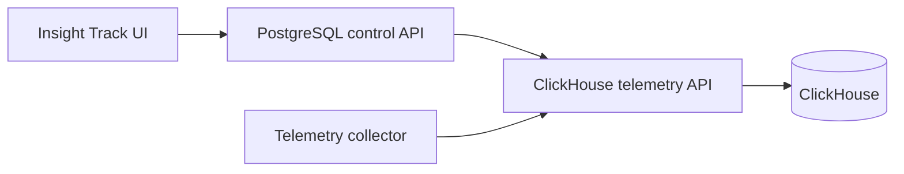

# ClickHouse Telemetry API

Go REST service for writing and querying Insight Track metrics, logs, and trace
spans in ClickHouse. It is a separate data-plane service from the PostgreSQL
project-tenancy API.

The service uses ClickHouse's HTTP interface with parameterized queries and the
Go standard library. It has no third-party Go runtime dependencies.

## Architecture



The API is designed for an internal network. Its bearer token authenticates a
trusted control-plane or collector, but does not prove that an end user belongs
to a project. The existing PostgreSQL/OIDC API must authorize project access
before proxying queries. Do not expose this service directly to browsers or the
public internet.

## Included endpoints

All telemetry routes are scoped by both `projectId` and `serviceId`.

| Method | Path | Purpose |
| --- | --- | --- |
| `GET` | `/health/live` | Process liveness |
| `GET` | `/health/ready` | ClickHouse readiness |
| `GET` | `/v1/projects/{projectId}/services/{serviceId}/telemetry/summary` | Counts, errors, and average span duration |
| `GET`, `POST` | `.../telemetry/metrics` | Query or ingest metrics |
| `GET`, `POST` | `.../telemetry/logs` | Query or ingest logs |
| `GET`, `POST` | `.../telemetry/traces` | Query or ingest trace spans |

The full request and response contract is in [`openapi.yaml`](openapi.yaml).

## Run locally

Requirements are Docker with Compose v2, curl, and Python 3 for the smoke test.

```bash
docker compose up --build --detach
curl http://localhost:8082/health/ready
```

Compose binds the API and ClickHouse HTTP port to loopback only:

- API: `http://localhost:8082`
- ClickHouse: `http://localhost:8123`
- Development API token: `local-development-token-0123456789abcdef`

These credentials are for local development only.

## Write a metric

```bash
project_id=019c3d56-7890-7abc-8def-0123456789ab
service_id=019c3d56-7890-7abc-8def-0123456789ac
api_token=local-development-token-0123456789abcdef

curl --fail --show-error \
  -H "Authorization: Bearer $api_token" \
  -H 'Content-Type: application/json' \
  -d '{
    "items": [{
      "timestamp": "2026-09-04T12:00:00Z",
      "name": "http.request.duration",
      "value": 42.5,
      "unit": "ms",
      "attributes": {"method": "GET", "route": "/health"}
    }]
  }' \
  "http://localhost:8082/v1/projects/$project_id/services/$service_id/telemetry/metrics"
```

Each ingestion request accepts 1–1000 items and at most 2 MiB. Unknown JSON
fields and non-JSON media types are rejected.

## Query telemetry


```bash
curl --fail --show-error \
  -H "Authorization: Bearer $api_token" \
  "http://localhost:8082/v1/projects/$project_id/services/$service_id/telemetry/metrics?name=http.request.duration&limit=100"
```

Query endpoints support an inclusive `from`, exclusive `to`, `limit`, and an
opaque `cursor`. The default range is the previous hour and a request cannot
span more than 31 days. Logs additionally support `severity` and `search`;
traces support `status` and `trace_id`.

## ClickHouse storage

The migration creates separate MergeTree tables for metrics, logs, and spans.
Every ordering key starts with `project_id` and `service_id`, and every query
adds both filters using ClickHouse HTTP query parameters. Data has a 30-day TTL;
ClickHouse applies TTL deletion asynchronously.

To recreate the local schema and delete local telemetry:

```bash
docker compose down --volumes
docker compose up --build --detach
```

For production, replace the local password and API token, keep ClickHouse on a
private network, terminate TLS, restrict database grants, set retention per
environment, and add per-tenant limits before accepting external telemetry.

## Configuration

| Variable | Default | Purpose |
| --- | --- | --- |
| `HTTP_ADDR` | `:8080` | API listen address |
| `API_TOKEN` | required | Internal bearer token, at least 32 characters |
| `CLICKHOUSE_HTTP_URL` | `http://localhost:8123` | ClickHouse HTTP endpoint |
| `CLICKHOUSE_DATABASE` | `insight_track` | Database created by the migration |
| `CLICKHOUSE_USERNAME` | `default` | ClickHouse user |
| `CLICKHOUSE_PASSWORD` | empty | ClickHouse password |
| `CLICKHOUSE_TIMEOUT` | `10s` | Per-request ClickHouse timeout |
| `HTTP_READ_HEADER_TIMEOUT` | `5s` | HTTP header timeout |
| `HTTP_READ_TIMEOUT` | `15s` | HTTP request timeout |
| `HTTP_WRITE_TIMEOUT` | `30s` | HTTP response timeout |
| `HTTP_IDLE_TIMEOUT` | `60s` | Keep-alive idle timeout |
| `SHUTDOWN_TIMEOUT` | `10s` | Graceful shutdown deadline |
| `LOG_LEVEL` | `info` | `debug`, `info`, `warn`, or `error` |

Copy `.env.example` when running the binary outside Compose.

## Development checks

```bash
make fmt-check
make test
make vet
docker compose config --quiet
make smoke
```

The smoke test starts an isolated stack, writes all three telemetry signals,
queries them, verifies authentication, and removes its Compose volume.
