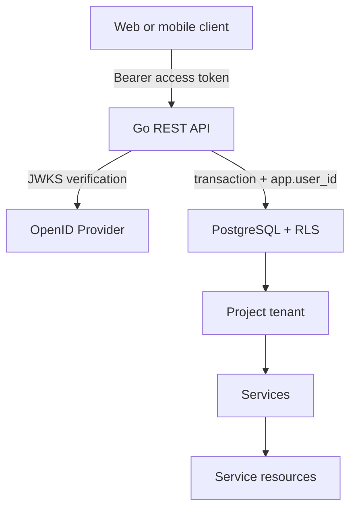

# Project Tenancy API

A Go REST service for project-based multi-tenancy on PostgreSQL. A user can own
many projects, share projects with other users at one common content-access
level, and create multiple services and resources inside each project.

PostgreSQL is the tenant boundary: every request runs in a transaction with a
transaction-local user ID, and row-level security (RLS) independently enforces
project membership. The API verifies OAuth 2.0 bearer tokens issued by an
OpenID Connect provider and maps users by the stable `(issuer, subject)` pair.

## What is included

- Go 1.27 REST API using `net/http`, `pgx`, and `go-oidc`.
- PostgreSQL schema, indexes, constraints, functions, triggers, audit events,
  optimistic versions, and RLS policies.
- Full project, membership, invitation, service, resource, and audit endpoints.
- OIDC JWT signature, issuer, audience, expiry, and not-before validation.
- Docker Compose stack with PostgreSQL, Keycloak, and the API.
- Local Keycloak realm with Alice and Bob test accounts.
- OpenAPI 3.1 contract and a cross-tenant smoke-test script.

## Architecture



Each project owner also has a `project_member` row. Presence in that table is
the one shared content-access level. Ownership is retained only for project
metadata, sharing administration, and deletion.

| Operation | Owner | Shared member |
| --- | ---: | ---: |
| Read project | Yes | Yes |
| Change/delete project | Yes | No |
| Invite/remove members | Yes | No |
| CRUD services and resources | Yes | Yes |
| Read audit history | Yes | Yes |

## Start with Docker Compose

Requirements: Docker with Compose v2, `curl`, and Python 3 for the smoke test.

```bash
docker compose up --build
```

Services become available at:

- API: `http://localhost:8080`
- Keycloak: `http://localhost:8081` (`admin` / `admin`, local only)
- PostgreSQL: `localhost:5432` (`postgres` / `postgres`, local only)

The included users are:

| Username | Password | Verified email |
| --- | --- | --- |
| `alice` | `alice` | `alice@example.test` |
| `bob` | `bob` | `bob@example.test` |

Get a local access token. Direct password grants are enabled only to make the
local CLI test short; real clients should use Authorization Code with PKCE.

```bash
ALICE_TOKEN=$(curl --fail --silent \
  --data-urlencode 'client_id=project-tenancy-cli' \
  --data-urlencode 'grant_type=password' \
  --data-urlencode 'username=alice' \
  --data-urlencode 'password=alice' \
  http://localhost:8081/realms/project-tenancy/protocol/openid-connect/token \
  | python3 -c 'import json,sys; print(json.load(sys.stdin)["access_token"])')
```

Create and list projects:

```bash
curl --fail --silent \
  -H "Authorization: Bearer $ALICE_TOKEN" \
  -H 'Content-Type: application/json' \
  -d '{"name":"Acme","description":"Example tenant"}' \
  http://localhost:8080/v1/projects

curl --fail --silent \
  -H "Authorization: Bearer $ALICE_TOKEN" \
  http://localhost:8080/v1/projects
```

Run the end-to-end test. It creates a project and service, verifies Bob gets a
cross-tenant `404`, shares the project through an invitation, verifies Bob can
then use services/resources, and confirms Bob still cannot rename the project.

```bash
./scripts/smoke.sh
```

Stop the stack without deleting database data:

```bash
docker compose down
```

To re-run first-start migrations against a clean local database, explicitly
remove the Compose volume with `docker compose down --volumes`; this deletes all
local database data.

## REST API

The complete request/response contract is in [`openapi.yaml`](openapi.yaml).
The base path is `/v1`; health endpoints are outside that base path.

| Method | Path | Permission |
| --- | --- | --- |
| `GET`, `PATCH` | `/v1/me` | Authenticated user |
| `GET`, `POST` | `/v1/projects` | Authenticated user |
| `GET`, `PATCH`, `DELETE` | `/v1/projects/{projectId}` | Member / owner / owner |
| `GET` | `/v1/projects/{projectId}/members` | Member |
| `DELETE` | `/v1/projects/{projectId}/members/{userId}` | Owner |
| `DELETE` | `/v1/projects/{projectId}/membership` | Shared member |
| `GET`, `POST` | `/v1/projects/{projectId}/invitations` | Owner |
| `DELETE` | `/v1/projects/{projectId}/invitations/{invitationId}` | Owner |
| `POST` | `/v1/invitations/accept` | Authenticated user |
| `GET`, `POST` | `/v1/projects/{projectId}/services` | Member |
| `GET`, `PATCH`, `DELETE` | `/v1/projects/{projectId}/services/{serviceId}` | Member |
| `GET`, `POST` | `/v1/projects/{projectId}/services/{serviceId}/resources` | Member |
| `GET`, `PATCH`, `DELETE` | `/v1/projects/{projectId}/services/{serviceId}/resources/{resourceId}` | Member |
| `GET` | `/v1/projects/{projectId}/audit-events` | Member |
| `GET` | `/health/live`, `/health/ready` | Public/internal |

Collections use `limit` (default 50, maximum 100) and opaque `cursor`
pagination. Versioned responses return a strong `ETag`, such as `"3"`.
`PATCH` and destructive versioned operations require that value in `If-Match`.

Errors use `application/problem+json` and include the request ID. IDs outside
the current tenant are normally indistinguishable from missing IDs and return
`404`.

## Sharing flow

1. The owner posts the recipient email to the project's invitations endpoint.
2. The service generates 32 cryptographically random bytes and stores only the
   SHA-256 digest of the base64url token.
3. A delivery adapter sends the raw token to the recipient.
4. After authenticating, the recipient posts that token in the JSON body of
   `/v1/invitations/accept`.
5. PostgreSQL locks and validates the invitation, verified email, expiry, and
   state, then creates membership atomically.

The included `log` adapter writes raw invitation tokens to API logs for the
local smoke test. Never use it in production. Replace it with an email adapter
and transactional outbox; do not put invitation tokens in URLs, access logs, or
the invitation response.

## Configuration

| Variable | Default | Purpose |
| --- | --- | --- |
| `HTTP_ADDR` | `:8080` | Listen address |
| `DATABASE_URL` | required | PostgreSQL connection URL for the login role |
| `DATABASE_ROLE` | `app_runtime` | Least-privilege role selected after connect |
| `AUTH_MODE` | `oidc` | `oidc`, or `dev` for isolated local testing |
| `ALLOW_DEV_AUTH` | `false` | Must explicitly be `true` when using dev auth |
| `OIDC_ISSUER` | required in OIDC mode | Exact access-token issuer |
| `OIDC_AUDIENCE` | required in OIDC mode | Required API audience |
| `OIDC_JWKS_URL` | discovery | Optional internal JWKS URL |
| `INVITATION_DELIVERY` | `log` | `log` or `disabled`; replace for production |
| `INVITATION_BASE_URL` | local URL | UI page shown by the local delivery adapter |
| `DATABASE_MAX_CONNS` | `20` | Maximum pool connections |
| `DATABASE_MIN_CONNS` | `2` | Minimum pool connections |
| `LOG_LEVEL` | `info` | `debug`, `info`, `warn`, or `error` |

Copy `.env.example` when running the binary outside Compose. In `dev` auth
mode, set `ALLOW_DEV_AUTH=true`; calls require `X-Dev-Subject`. Optional headers are `X-Dev-Email`,
`X-Dev-Email-Verified`, `X-Dev-Name`, and `X-Dev-Avatar`. Dev mode must never be
enabled on an externally reachable deployment.

## Database and RLS

Apply `migrations/001_init.sql` as a migration owner with permission to create
roles and the `pgcrypto` extension. Provision a separate login and grant it
`app_runtime`. The Compose-only `002_compose_role.sql` demonstrates that setup
with local credentials and must not be reused in production.

Every repository operation follows this pattern:

```sql
BEGIN;
SELECT set_config('app.user_id', :validated_user_id, true);
-- RLS-protected statements
COMMIT;
```

`true` makes the setting transaction-local, preventing identity leakage when a
connection returns to the pool. The runtime role does not own objects, is not a
superuser, and cannot bypass RLS. Service-resource foreign keys include both
`project_id` and `service_id`, preventing cross-project relationships even when
application code is wrong.

## Development checks

```bash
go mod tidy
go test ./...
go vet ./...
docker compose config --quiet
./scripts/smoke.sh
```

The Docker build is multi-stage and runs the final process as an unprivileged
user. Pin image digests, scan the image, add rate limits, connect a real email
outbox, and manage secrets through your deployment platform before production.

## Repository layout

```text
cmd/api/                 service entry point
internal/auth/           OIDC and local-development authentication
internal/config/         environment configuration
internal/httpapi/        routing, validation, errors, middleware, handlers
internal/invite/         invitation-delivery adapter
internal/store/          pgx repositories and RLS transactions
migrations/              PostgreSQL schema and Compose-only login
deploy/keycloak/         local OIDC realm
scripts/smoke.sh         end-to-end tenant-isolation check
compose.yaml             local stack
openapi.yaml             OpenAPI 3.1 contract
```
